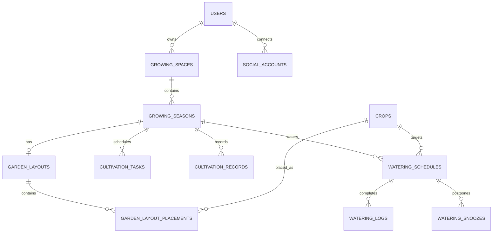

# 심어봄 현재 아키텍처

이 문서는 계획이 아니라 현재 저장소에 구현된 구조만 설명합니다.

## 실행 구조

```text
브라우저
  ├→ Next.js 16 App Router → /api/v1, /sanctum rewrite
  └→ Laravel Blade 관리자 콘솔 (/admin)
  → Laravel 12 + Sanctum
  → MySQL/MariaDB
```

프론트엔드는 DB에 직접 접근하지 않습니다. 로컬에서도 사용자 데이터의 단일 기준은 Laravel DB입니다.

## 프론트엔드 경계

```text
app route
  → features/<domain>/components
  → features/<domain>/hooks
  → features/<domain>/infrastructure
  → shared/infrastructure/api-client

features/<domain>/domain
  → 프레임워크와 네트워크에 의존하지 않는 타입·계산·검증
```

주요 도메인은 `auth`, `crop-catalog`, `growing-space`, `growing-season`, `garden-layout`, `cultivation-schedule`, `cultivation-record`, `watering`, `dashboard`입니다.

- 도메인 규칙은 컴포넌트 안에 중복 구현하지 않습니다.
- 한 도메인 전용 코드는 `shared`로 올리지 않습니다.
- 서버 오류를 빈 배열이나 기본값으로 숨기지 않습니다.
- TypeScript strict를 유지하고 `any`, `as any`, `as unknown`을 사용하지 않습니다.

## 백엔드 경계

```text
routes/api.php
  → Form Request: 인증 가능한 입력, 허용 필드, 경계값 검증
  → Controller: 권한 확인과 유스케이스 호출
  → Action: 트랜잭션, 잠금, 상태 변경
  → Model: 관계와 타입 변환
  → JsonResource: 공개 응답 계약
```

- 컨트롤러에 긴 저장 로직을 넣지 않습니다.
- 사용자 자원은 정책과 소유 관계 쿼리로 분리합니다.
- 여러 테이블을 바꾸는 쓰기 작업은 트랜잭션에서 처리합니다.
- 삭제 제약이나 중복과 같은 관계 오류는 명시적인 `409` 코드로 반환합니다.
- 내부 예외와 스택 추적을 API 응답에 노출하지 않습니다.

## 관리자 콘솔 경계

관리자 콘솔은 사용자용 Next.js 화면과 분리된 Laravel Blade 웹 화면입니다. 동일한 Laravel 세션을 사용하지만 `auth`와 `admin` 미들웨어를 모두 통과해야 합니다.

```text
routes/web.php
  → Admin Controller: 조회 조건과 화면 응답
  → Admin Action/Service: 상태 변경과 운영 지표 계산
  → Eloquent Model
  → Blade View
```

- `role=admin`, `status=active`인 계정만 접근합니다.
- 일반 회원을 비활성화하면 세션과 Sanctum 토큰을 함께 폐기합니다.
- 관리자 자신과 다른 관리자 계정은 회원 관리 화면에서 비활성화할 수 없습니다.
- 작물 기준정보는 현재 조회 전용이며 변경은 기준 데이터와 마이그레이션으로 공유합니다.

## 데이터베이스 기준

유일한 스키마 기준은 `backend/database/migrations`입니다.

현재 마이그레이션은 다음 영역을 만듭니다.

- 사용자, 세션, 캐시, 큐, Sanctum 토큰
- 주소 좌표·공간 방향·예상 일조 시간을 포함한 재배 공간과 재배 시즌
- 작물·과·분류·재배 기준정보와 출처
- 텃밭 격자와 작물 배치
- 재배 일정
- 시즌 활동 기록
- 물주기 일정·완료 기록·미루기 기록

사용자·공간·시즌·배치·일정·기록 ID는 UUIDv7입니다. 작물 ID는 `lettuce` 같은 slug입니다. 테이블이나 컬럼 변경은 항상 새 Laravel 마이그레이션과 테스트로 공유합니다.

## 인증과 브라우저 연결

Laravel Sanctum SPA 세션 인증을 사용합니다.

```text
GET /sanctum/csrf-cookie
→ POST /api/v1/auth/login 또는 register, 또는 GET /auth/google/redirect
→ HttpOnly 세션 쿠키
→ 보호 API 요청에 쿠키와 X-XSRF-TOKEN 전송
```

Google 로그인은 Laravel Socialite의 OAuth state 검증을 거쳐 이메일이 확인된 계정을 `social_accounts`에 연결하고 동일한 Laravel 세션을 발급합니다. OAuth 비밀키나 액세스 토큰은 프론트엔드와 DB에 노출·저장하지 않습니다.

프론트엔드의 `api-client.ts`가 CSRF 준비와 공통 오류 변환을 담당합니다. 토큰이나 DB 비밀번호를 `localStorage` 또는 `NEXT_PUBLIC_*` 비밀값으로 저장하지 않습니다.

## 응답과 오류 계약

- 단일 자원: `{ "data": {...} }`
- 목록: `{ "data": [...], "meta": {...} }`
- 오류: `{ "error": { "code", "message", "fields" } }`
- 삭제 성공: `204 No Content`

일반 상태 코드는 `401` 인증 필요, `403` 소유권 없음, `404` 없음, `409` 관계 충돌, `412` 버전 충돌, `419` CSRF 실패, `422` 입력 오류입니다.

## 동시 수정

수정 가능한 사용자 자원은 정수 `version`을 가집니다. 서버는 현재 버전을 `ETag`로 반환하고, 프론트엔드는 수정·삭제 시 `If-Match`로 보냅니다. 버전이 오래되면 서버는 `412 VERSION_CONFLICT`를 반환하며 저장하지 않습니다.

## API 기준

- 실제 라우트: `backend/routes/api.php`
- 요청 규칙: `backend/app/Http/Requests/Api/V1`
- 응답 필드: `backend/app/Http/Resources/Api/V1`
- 기계 판독 명세: [openapi.yaml](openapi.yaml)
- 실제 행동 보장: `backend/tests/Feature/Api/V1`

새 API를 추가하거나 변경할 때 위 네 곳과 프론트 API 테스트를 함께 갱신합니다.

## 핵심 데이터 관계



정확한 컬럼·인덱스·삭제 정책은 마이그레이션 파일을 기준으로 확인합니다.
