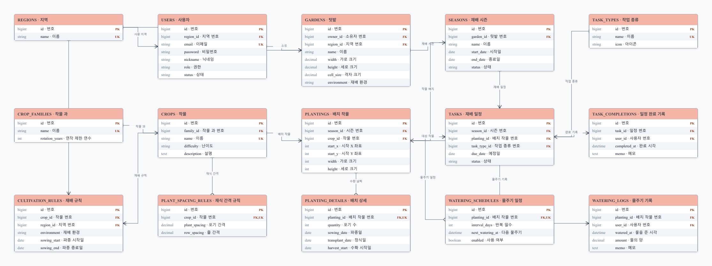
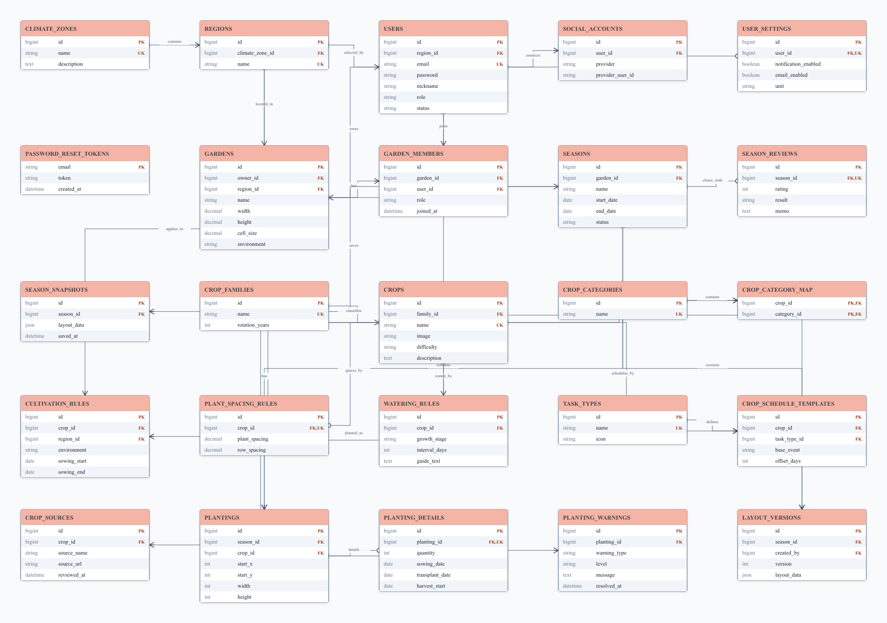
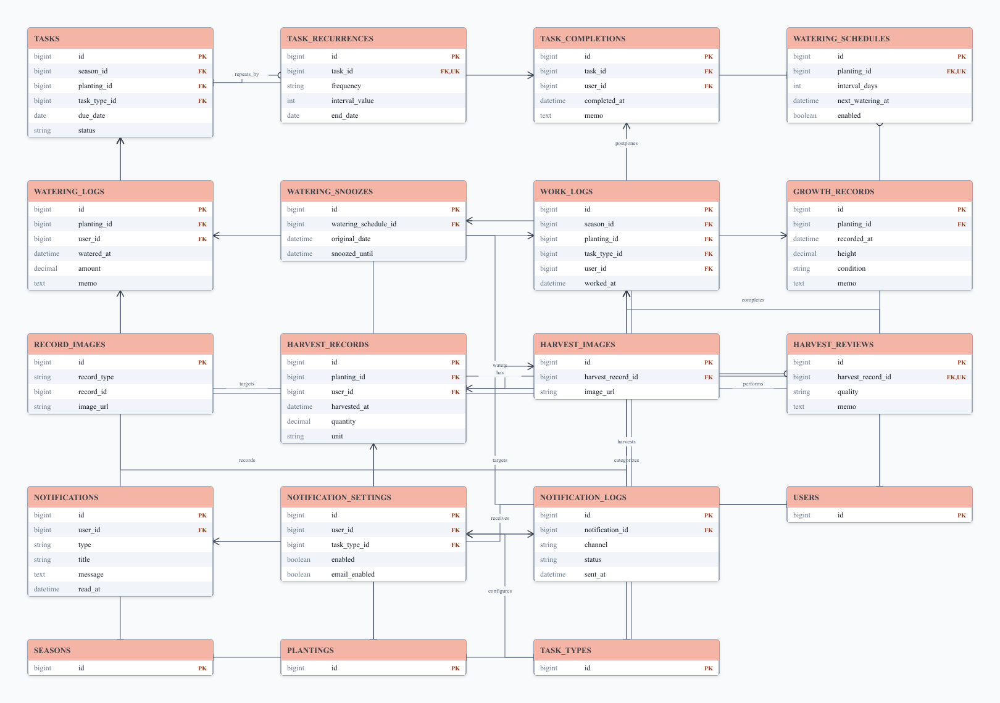
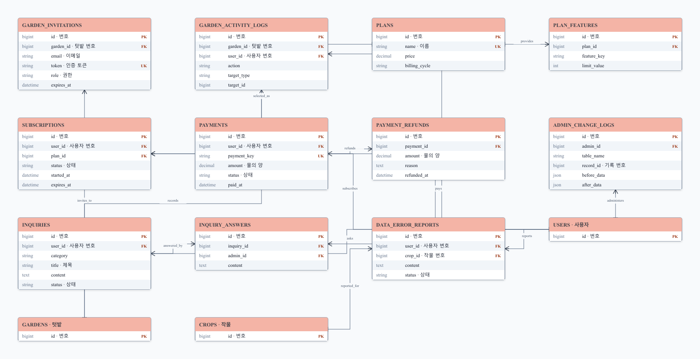

# 심어봄 ERD

이 문서는 심어봄의 개념 ERD입니다. **MVP(Minimum Viable Product, 최소 기능 제품)**는 정해진 기간 안에 핵심 사용 흐름을 실제로 사용할 수 있게 만든 첫 번째 완성 버전을 뜻합니다.

- PK: 기본키
- FK: 외래키
- UK: 고유값
- 실제 Laravel 마이그레이션을 작성할 때 자료형, nullable 여부, 인덱스와 삭제 정책을 최종 확정합니다.

## Laravel 물리 스키마 구현 기준

이 문서의 그림은 업무 개념과 관계를 설명하는 개념 ERD입니다. 실제 Laravel 테이블과 API를 구현할 때는 아래 규칙을 단일 기준으로 사용합니다.

| 개념 ERD | Laravel 물리 이름 | 기본키 | 비고 |
| --- | --- | --- | --- |
| `USERS` | `users` | UUIDv7 | 이메일은 소문자로 정규화하고 고유 제약 적용 |
| `GARDENS` | `growing_spaces` | UUIDv7 | 외부 API 경로는 `/spaces` 유지 |
| `SEASONS` | `growing_seasons` | UUIDv7 | `growing_space_id`로 공간 참조 |
| `CROPS` | `crops` | slug 문자열 | `lettuce`, `young-radish`처럼 읽을 수 있는 ID |
| 사용자 일정·기록 | 해당 복수형 테이블 | UUIDv7 | 외부에 노출되는 자원은 순차 번호를 사용하지 않음 |
| 내부 기준 데이터 | 해당 복수형 테이블 | bigint 또는 고정 코드 | 지역·작물 과·작업 종류처럼 외부 자원이 아닌 데이터 |

공통 구현 규칙:

- API JSON은 `camelCase`, DB 컬럼은 `snake_case`를 사용하고 Laravel Resource에서 변환합니다.
- 사용자 소유 데이터는 외래키와 정책(Policy)으로 소유권을 검사합니다. 요청의 사용자 ID를 그대로 저장하지 않습니다.
- 수정 가능한 자원에는 1부터 시작하는 `version`을 두고 `ETag`와 `If-Match`로 동시 수정 충돌을 막습니다.
- 날짜만 필요한 값은 `date`, 실제 시각은 UTC 기준 `timestamp`를 사용합니다.
- FK 삭제 정책은 기록 유실을 막기 위해 기본적으로 `restrict`를 사용하고, 자식 데이터의 수명이 부모와 완전히 같을 때만 `cascade`를 사용합니다.
- 이미 공유된 마이그레이션은 수정하지 않고 새 마이그레이션으로 변경 이력을 남깁니다.
- 현재 프론트엔드 계약에 없는 `users.region_id`와 공동 관리 테이블은 핵심 흐름 이후로 미룹니다.

핵심 구현 순서는 `인증 → 재배 공간 → 재배 시즌 → 작물 배치 → 일정·기록`입니다. 각 단계는 마이그레이션, 모델 관계, API, 실패 경로 테스트까지 함께 완료합니다.

## 먼저 구현할 핵심 기능 ERD

회원가입부터 텃밭·시즌 등록, 작물 배치, 재배 일정과 물주기 기록까지에 필요한 테이블만 모았습니다. 아래 테이블은 모두 하나의 데이터베이스 안에서 연결됩니다.



## 전체 설계 참고

### 핵심 기능 전체 구조



### 일정·물주기·기록



### 공동 관리·결제·관리자 확장 — 현재 사용하지 않음



## 1. 핵심 기능 전체 ERD 원본

```mermaid
erDiagram
    CLIMATE_ZONES ||--o{ REGIONS : contains
    REGIONS ||--o{ USERS : selected_by
    REGIONS ||--o{ GARDENS : located_in
    REGIONS ||--o{ CULTIVATION_RULES : applies_to

    USERS ||--o{ SOCIAL_ACCOUNTS : connects
    USERS ||--o| USER_SETTINGS : configures
    USERS ||--o{ GARDENS : owns
    USERS ||--o{ GARDEN_MEMBERS : joins

    GARDENS ||--o{ GARDEN_MEMBERS : has
    GARDENS ||--o{ SEASONS : runs
    SEASONS ||--o{ PLANTINGS : contains
    SEASONS ||--o| SEASON_REVIEWS : closes_with
    SEASONS ||--o{ SEASON_SNAPSHOTS : saves
    SEASONS ||--o{ LAYOUT_VERSIONS : versions

    CROP_FAMILIES ||--o{ CROPS : classifies
    CROPS ||--o{ CROP_CATEGORY_MAP : mapped_to
    CROP_CATEGORIES ||--o{ CROP_CATEGORY_MAP : contains
    CROPS ||--o{ CULTIVATION_RULES : has
    CROPS ||--o| PLANT_SPACING_RULES : spaces_by
    CROPS ||--o{ WATERING_RULES : waters_by
    CROPS ||--o{ CROP_SCHEDULE_TEMPLATES : schedules_by
    CROPS ||--o{ CROP_SOURCES : documented_by
    TASK_TYPES ||--o{ CROP_SCHEDULE_TEMPLATES : defines

    CROPS ||--o{ PLANTINGS : planted_as
    PLANTINGS ||--o| PLANTING_DETAILS : details
    PLANTINGS ||--o{ PLANTING_WARNINGS : warns
    USERS ||--o{ LAYOUT_VERSIONS : creates

    CLIMATE_ZONES {
        bigint id PK
        string name UK
        text description
    }
    REGIONS {
        bigint id PK
        bigint climate_zone_id FK
        string name UK
    }
    USERS {
        bigint id PK
        bigint region_id FK
        string email UK
        string password
        string nickname
        string role
        string status
    }
    SOCIAL_ACCOUNTS {
        bigint id PK
        bigint user_id FK
        string provider
        string provider_user_id
    }
    USER_SETTINGS {
        bigint id PK
        bigint user_id FK,UK
        boolean notification_enabled
        boolean email_enabled
        string unit
    }
    PASSWORD_RESET_TOKENS {
        string email PK
        string token
        datetime created_at
    }
    GARDENS {
        bigint id PK
        bigint owner_id FK
        bigint region_id FK
        string name
        decimal width
        decimal height
        decimal cell_size
        string environment
    }
    GARDEN_MEMBERS {
        bigint id PK
        bigint garden_id FK
        bigint user_id FK
        string role
        datetime joined_at
    }
    SEASONS {
        bigint id PK
        bigint garden_id FK
        string name
        date start_date
        date end_date
        string status
    }
    SEASON_REVIEWS {
        bigint id PK
        bigint season_id FK,UK
        int rating
        string result
        text memo
    }
    SEASON_SNAPSHOTS {
        bigint id PK
        bigint season_id FK
        json layout_data
        datetime saved_at
    }
    CROP_FAMILIES {
        bigint id PK
        string name UK
        int rotation_years
    }
    CROPS {
        bigint id PK
        bigint family_id FK
        string name UK
        string image
        string difficulty
        text description
    }
    CROP_CATEGORIES {
        bigint id PK
        string name UK
    }
    CROP_CATEGORY_MAP {
        bigint crop_id PK,FK
        bigint category_id PK,FK
    }
    CULTIVATION_RULES {
        bigint id PK
        bigint crop_id FK
        bigint region_id FK
        string environment
        date sowing_start
        date sowing_end
    }
    PLANT_SPACING_RULES {
        bigint id PK
        bigint crop_id FK,UK
        decimal plant_spacing
        decimal row_spacing
    }
    WATERING_RULES {
        bigint id PK
        bigint crop_id FK
        string growth_stage
        int interval_days
        text guide_text
    }
    TASK_TYPES {
        bigint id PK
        string name UK
        string icon
    }
    CROP_SCHEDULE_TEMPLATES {
        bigint id PK
        bigint crop_id FK
        bigint task_type_id FK
        string base_event
        int offset_days
    }
    CROP_SOURCES {
        bigint id PK
        bigint crop_id FK
        string source_name
        string source_url
        datetime reviewed_at
    }
    PLANTINGS {
        bigint id PK
        bigint season_id FK
        bigint crop_id FK
        int start_x
        int start_y
        int width
        int height
    }
    PLANTING_DETAILS {
        bigint id PK
        bigint planting_id FK,UK
        int quantity
        date sowing_date
        date transplant_date
        date harvest_start
    }
    PLANTING_WARNINGS {
        bigint id PK
        bigint planting_id FK
        string warning_type
        string level
        text message
        datetime resolved_at
    }
    LAYOUT_VERSIONS {
        bigint id PK
        bigint season_id FK
        bigint created_by FK
        int version
        json layout_data
    }
}
```

## 2. 일정·물주기·기록 ERD

```mermaid
erDiagram
    SEASONS ||--o{ TASKS : schedules
    PLANTINGS ||--o{ TASKS : targets
    TASK_TYPES ||--o{ TASKS : categorizes
    TASKS ||--o| TASK_RECURRENCES : repeats_by
    TASKS ||--o{ TASK_COMPLETIONS : completed_as
    USERS ||--o{ TASK_COMPLETIONS : completes

    PLANTINGS ||--o| WATERING_SCHEDULES : has
    WATERING_SCHEDULES ||--o{ WATERING_SNOOZES : postpones
    PLANTINGS ||--o{ WATERING_LOGS : records
    USERS ||--o{ WATERING_LOGS : waters

    SEASONS ||--o{ WORK_LOGS : records
    PLANTINGS ||--o{ WORK_LOGS : targets
    TASK_TYPES ||--o{ WORK_LOGS : categorizes
    USERS ||--o{ WORK_LOGS : performs
    PLANTINGS ||--o{ GROWTH_RECORDS : grows
    PLANTINGS ||--o{ HARVEST_RECORDS : harvested_as
    USERS ||--o{ HARVEST_RECORDS : harvests
    HARVEST_RECORDS ||--o{ HARVEST_IMAGES : has
    HARVEST_RECORDS ||--o| HARVEST_REVIEWS : reviewed_as

    USERS ||--o{ NOTIFICATIONS : receives
    TASK_TYPES ||--o{ NOTIFICATION_SETTINGS : configures
    USERS ||--o{ NOTIFICATION_SETTINGS : owns
    NOTIFICATIONS ||--o{ NOTIFICATION_LOGS : delivered_as

    TASKS {
        bigint id PK
        bigint season_id FK
        bigint planting_id FK
        bigint task_type_id FK
        date due_date
        string status
    }
    TASK_RECURRENCES {
        bigint id PK
        bigint task_id FK,UK
        string frequency
        int interval_value
        date end_date
    }
    TASK_COMPLETIONS {
        bigint id PK
        bigint task_id FK
        bigint user_id FK
        datetime completed_at
        text memo
    }
    WATERING_SCHEDULES {
        bigint id PK
        bigint planting_id FK,UK
        int interval_days
        datetime next_watering_at
        boolean enabled
    }
    WATERING_LOGS {
        bigint id PK
        bigint planting_id FK
        bigint user_id FK
        datetime watered_at
        decimal amount
        text memo
    }
    WATERING_SNOOZES {
        bigint id PK
        bigint watering_schedule_id FK
        datetime original_date
        datetime snoozed_until
    }
    WORK_LOGS {
        bigint id PK
        bigint season_id FK
        bigint planting_id FK
        bigint task_type_id FK
        bigint user_id FK
        datetime worked_at
    }
    GROWTH_RECORDS {
        bigint id PK
        bigint planting_id FK
        datetime recorded_at
        decimal height
        string condition
        text memo
    }
    RECORD_IMAGES {
        bigint id PK
        string record_type
        bigint record_id
        string image_url
    }
    HARVEST_RECORDS {
        bigint id PK
        bigint planting_id FK
        bigint user_id FK
        datetime harvested_at
        decimal quantity
        string unit
    }
    HARVEST_IMAGES {
        bigint id PK
        bigint harvest_record_id FK
        string image_url
    }
    HARVEST_REVIEWS {
        bigint id PK
        bigint harvest_record_id FK,UK
        string quality
        text memo
    }
    NOTIFICATIONS {
        bigint id PK
        bigint user_id FK
        string type
        string title
        text message
        datetime read_at
    }
    NOTIFICATION_SETTINGS {
        bigint id PK
        bigint user_id FK
        bigint task_type_id FK
        boolean enabled
        boolean email_enabled
    }
    NOTIFICATION_LOGS {
        bigint id PK
        bigint notification_id FK
        string channel
        string status
        datetime sent_at
    }
    USERS {
        bigint id PK
    }
    SEASONS {
        bigint id PK
    }
    PLANTINGS {
        bigint id PK
    }
    TASK_TYPES {
        bigint id PK
    }
}
```

`record_images`는 `record_type`과 `record_id`로 작업 기록 또는 성장 기록을 가리키는 다형 관계입니다. Laravel 구현 시 morph 관계로 처리할 수 있습니다.

## 3. 공동 관리·결제·관리자 확장 ERD

이 영역은 현재 핵심 기능 개발이 끝난 후 적용할 확장 범위입니다.

```mermaid
erDiagram
    GARDENS ||--o{ GARDEN_INVITATIONS : invites_to
    GARDENS ||--o{ GARDEN_ACTIVITY_LOGS : records
    USERS ||--o{ GARDEN_ACTIVITY_LOGS : acts

    PLANS ||--o{ PLAN_FEATURES : provides
    PLANS ||--o{ SUBSCRIPTIONS : selected_as
    USERS ||--o{ SUBSCRIPTIONS : subscribes
    USERS ||--o{ PAYMENTS : pays
    PAYMENTS ||--o{ PAYMENT_REFUNDS : refunds

    USERS ||--o{ ADMIN_CHANGE_LOGS : administers
    USERS ||--o{ INQUIRIES : asks
    INQUIRIES ||--o{ INQUIRY_ANSWERS : answered_by
    USERS ||--o{ INQUIRY_ANSWERS : answers
    USERS ||--o{ DATA_ERROR_REPORTS : reports
    CROPS ||--o{ DATA_ERROR_REPORTS : reported_for

    GARDEN_INVITATIONS {
        bigint id PK
        bigint garden_id FK
        string email
        string token UK
        string role
        datetime expires_at
    }
    GARDEN_ACTIVITY_LOGS {
        bigint id PK
        bigint garden_id FK
        bigint user_id FK
        string action
        string target_type
        bigint target_id
    }
    PLANS {
        bigint id PK
        string name UK
        decimal price
        string billing_cycle
    }
    PLAN_FEATURES {
        bigint id PK
        bigint plan_id FK
        string feature_key
        int limit_value
    }
    SUBSCRIPTIONS {
        bigint id PK
        bigint user_id FK
        bigint plan_id FK
        string status
        datetime started_at
        datetime expires_at
    }
    PAYMENTS {
        bigint id PK
        bigint user_id FK
        string payment_key UK
        decimal amount
        string status
        datetime paid_at
    }
    PAYMENT_REFUNDS {
        bigint id PK
        bigint payment_id FK
        decimal amount
        text reason
        datetime refunded_at
    }
    ADMIN_CHANGE_LOGS {
        bigint id PK
        bigint admin_id FK
        string table_name
        bigint record_id
        json before_data
        json after_data
    }
    INQUIRIES {
        bigint id PK
        bigint user_id FK
        string category
        string title
        text content
        string status
    }
    INQUIRY_ANSWERS {
        bigint id PK
        bigint inquiry_id FK
        bigint admin_id FK
        text content
    }
    DATA_ERROR_REPORTS {
        bigint id PK
        bigint user_id FK
        bigint crop_id FK
        text content
        string status
    }
    USERS {
        bigint id PK
    }
    GARDENS {
        bigint id PK
    }
    CROPS {
        bigint id PK
    }
}
```

## 구현 전 확인할 제약조건

- `social_accounts`: `(provider, provider_user_id)` 고유 제약
- `garden_members`: `(garden_id, user_id)` 고유 제약
- `crop_category_map`: `(crop_id, category_id)` 복합 기본키
- `cultivation_rules`: 작물·지역·환경 조합의 중복 방지
- `layout_versions`: `(season_id, version)` 고유 제약
- `notification_settings`: `(user_id, task_type_id)` 고유 제약
- 좌표와 크기는 0보다 작을 수 없고, 배치 영역은 텃밭 격자를 벗어날 수 없음
- 외래키 삭제 정책은 사용자 기록 보존 여부를 정한 뒤 `cascade`, `restrict`, `set null` 중 선택
